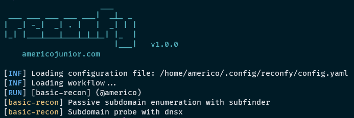

<h1 align="center">
  </a>
  <br>
</h1>
<p>Fast and customizable reconnaissance workflow tool based on simple YAML based DSL, with support of notifications and distributed workload of that workflow easily.</p>

<p align="center">
  <a href="#features">Features</a> •
  <a href="#installation">Install</a> •
  <a href="#usage">Usage</a> •
</p>

## Features

</a>

- Automated reconnaissance workflow
- Discord notification
- Workflow's distributed workload with digital ocean droplets (TO-DO)

## Installation

1. Clone the repository

```sh
git clone https://github.com/americo/reconfy
```

2. Run in terminal

```sh
cd reconfy
sudo python3 setup.py install
```

### Configuration file

Create file and save the configuration file at `~/.config/reconfy/config.yaml`

```yaml
notifications:
  discord_webhook_url: "YOUR_DISCORD_WEBHOOK"
cloud:
  digitalocean: "YOUR_DIGITAL_OCEAN_API_TOKEN"
```

## Usage

### 1. Create your yaml workflow file

```yaml
id: workflow-name

info:
  author: author-name
  name: Workflow name

steps:
  - name: command 1
    run: |
      bash command
  - name: command 2
    run: |
      bash command
```

2. Run the workflow

```sh
reconfy -workflow workflow.yaml -config config.yaml -name your_project_name
```

### 3. In order to run your script with specified target, you must use $1 inside workflow and set -target flag:

Example of usage:

```yaml
id: workflow-name

info:
  author: author-name
  name: Workflow name

steps:
  - name: command 1
    run: |
      echo $1 | gau >> gauoutput.txt
```

Now run the workflow

```sh
reconfy -workflow workflow.yaml -config config.yaml -name your_project_name -target target.com
```
Look now the script will be replaced by `echo target.com | gau >> gauoutput.txt`

### Help

```sh
reconfy -h
```

This will display help for the tool. Here are all the switches it supports.

```sh
usage: reconfy [-h] -workflow WORKFLOW -config CONFIG_FILE [-notify] -name PROJECT_NAME [-droplets DROPLETS_NUMBER] [-silent] [-target TARGET]

optional arguments:
  -h, --help            show this help message and exit
  -workflow WORKFLOW    Recon workflow file.
  -config CONFIG_FILE   Configuration file.
  -notify               Enable discord notification for steps (Setup your config file first.)
  -name PROJECT_NAME    Project name.
  -droplets DROPLETS_NUMBER
                        Digital ocean droplets number.
  -silent               Silent mode
  -target               Target, see README.
```
